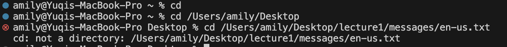
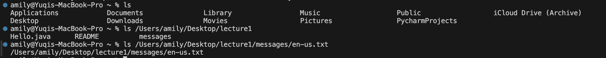
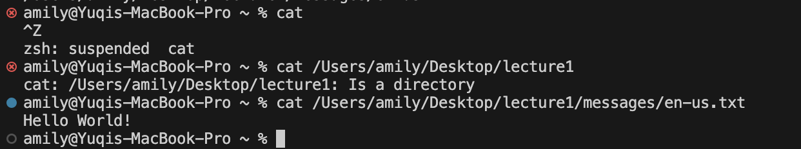

# Command 1 cd

**1.cd with no argument: output is not an error**

There will be no output with this input. By using the cd command, we change the current working directory to the directory followed by cd.
Since there is no argument followed by cd in this case, then the working directory will not be changed, which is still /Users/amily in this case. 
The absolute path to the working directory right before the command was run is /Users/amily

**2.cd with a path to a directory: output is not an error**

No output for this command because it simply changes the working directory to the absolute path I entered, which is /Users/amily/Desktop.
The absolute path to the working directory before the command run is /Users/amily

**3.cd with a path to a file: output is an error**

Because cd is the command for changing the directory. The absolute path to a file is not a directory. Thus, it will result in an erroe message.
The abosulte path to the working directory before the command run is /Users/amily/Desktop

# Command 2 ls

**1.ls with no argument: output is not an error**

The abosulte path before the command run is /Users/amily
ls with no argument will list all contents within the current working dirctory, which is /Users/amily

**2.ls with path to a directory: output is not an error**

The absolute path before the command run is /Users/amily
This will list all contents of under the directory of /Users/amily/Desktop/lecture1

**3.ls with a path to a file: output is not an error**

The absolute path before the command run is /Users/amily
This will display the absolute path to the specific file

# Command 3 cat

**1.cat with no argument: output is not an error**

The absolute path before the command run is /Users/amily
cat command will contanete and display the contents of files
cat with no argument will wait for input. Press Control+z to quit

**2.cat with path to a directory: output is an error**

The absolute path before the command run is /Users/amily
because we provide a path to directory, it will lead to an error message because cat can only display the contents of files, not the contents of directory.

**3.cat with path to a file: output is not an error**

The absolute path before the command run is /Users/amily
because we provide a path to files, then it will display the content of the file that I provide the abosulte path, which is "Hello World!"
