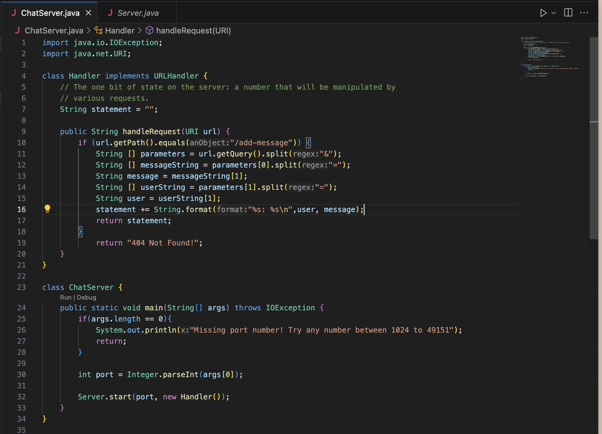
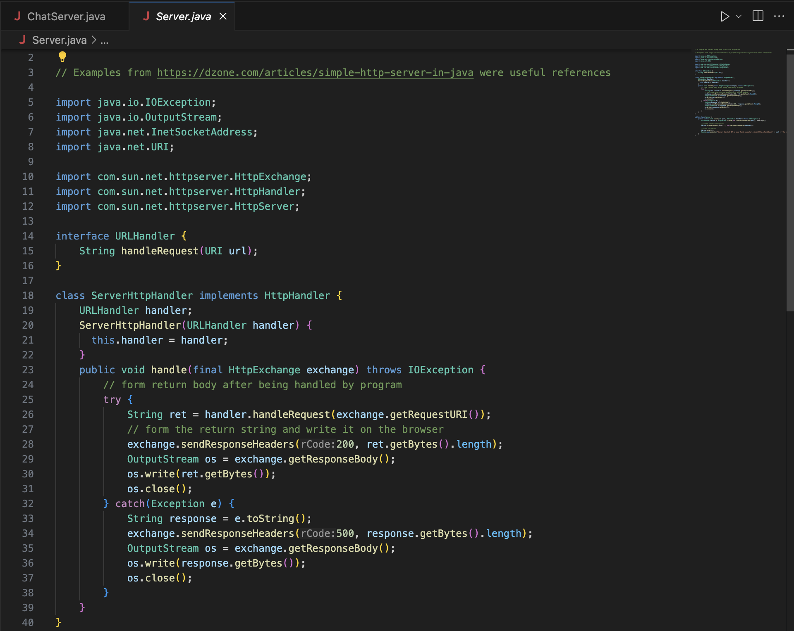
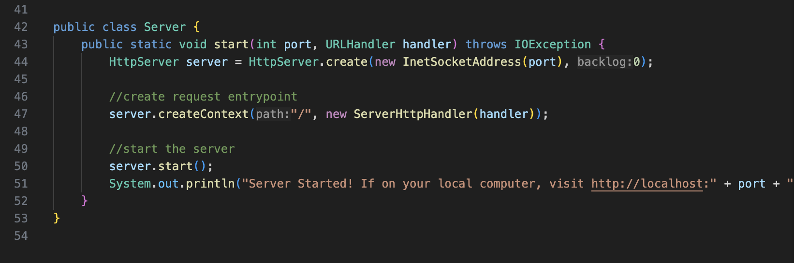
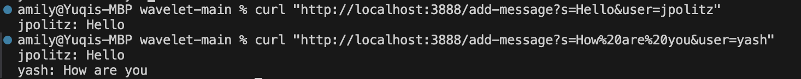

# Part 1

The main method in `ChatServer` class is called and it uses `handleRequest` method. There are several relevant arguments to `handleRequest` method.
First, it will check whether the url contain `/add-message` through the `if` statement. If so, the first filed changed is `parameters`, a string array that stores the two string after the question mark, after using `split` method. So, it should be from `s=Hello&user=jpolitz` to `{"s=hello", "user=jpolitz"}`, with index zero and one respectively. Then, use `split` method again to seperate the message and user from these two string into `hello` and `jpolitz` and store them as two strings called `message` and `user` respectively. At the beginning of the class(outside the `handleRequest` method), I create a instance variable called `statement` to store the message to displace and initialize it without any content.
After we execute the above code, `statement` will be changed to `jpolitz: hello` through `+=` and being stored. Thus if we now input `/add-message?s=How%20are%20you&user=yash`, it will go through the same process as the previous input and being displayed with the previous message. 

# Part2

# Part3

