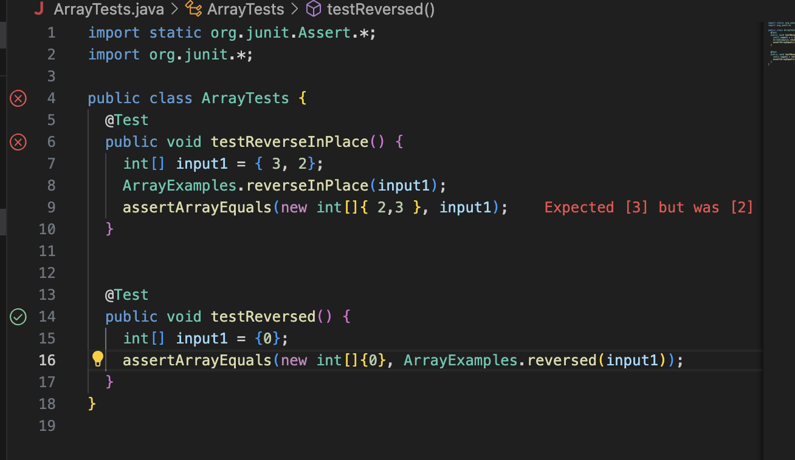
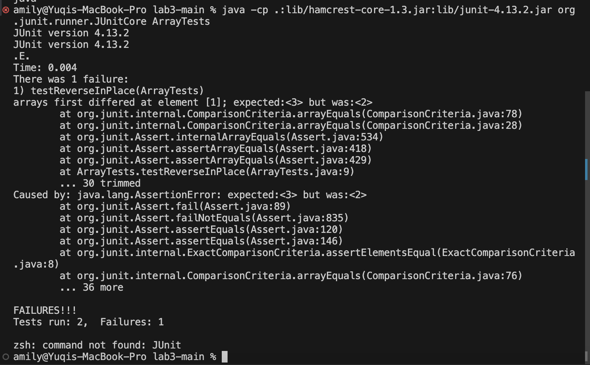
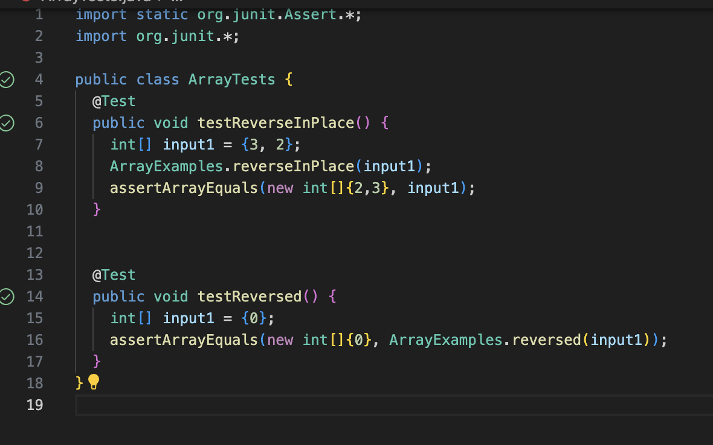

# Part1
**1. failure-inducing input:**


```
public class ArrayTests {
  @Test
   public void testReverseInPlace() {
    int[] input1 = {3,2};
    ArrayExamples.reverseInPlace(input1);
    assertArrayEquals(new int[]{2,3}, input1);
 }
```

**2. input that does not induce error:**


```
@Test
  public void testReversed() {
    int[] input1 = { };
    assertArrayEquals(new int[]{ }, ArrayExamples.reversed(input1));
  }
```


**3. symptom**



**4. bug**


-Previous:

```
static void reverseInPlace(int[] arr) {
    for(int i = 0; i < arr.length; i += 1) {
      arr[i] = arr[arr.length - i - 1];
    }
  }
```
  
```
// Returns a *new* array with all the elements of the input array in reversed
  // order
  static int[] reversed(int[] arr) {
    int[] newArray = new int[arr.length];
    for(int i = 0; i < arr.length; i += 1) {
      arr[i] = newArray[arr.length - i - 1];
    }
    return arr;
  }
```


-After fix:


```
public class ArrayExamples {
  // Changes the input array to be in reversed order
  static void reverseInPlace(int[] arr) {
    int[] newArray = ArrayExamples.reversed(arr);
    for(int i = 0; i < arr.length; i += 1) {
      arr[i] = newArray[i];
    }
  }
 // Returns a *new* array with all the elements of the input array in reversed
// order
  static int[] reversed(int[] arr) {
    int[] newArray = new int[arr.length];
    for(int i = 0; i < arr.length; i += 1) {
      newArray[i] = arr[arr.length-i-1];
    }
    return newArray;
  }
```

**5 comment on fixing the issue**


This issue with previous code is method `reverseInPlace` because it is assigning value to itself. Thus, elements in `arr` will be mixed up during the process of re-assigning. We need to create a new array called `newArray` in this code to hold the reversed order of `arr` through calling method `reversed`. Then, we can assign the elements in `newArray` to `arr` to change the input array in reversed order. Then the tests should pass. See below


# Part2

`grep` is a command for searching specific content within a file system.


**1. `grep -r`**
```
amily@Yuqis-MBP docsearch % grep -r "PLANES" ./technical/         
./technical//911report/chapter-1.txt:"WE HAVE SOME PLANES"
./technical//911report/chapter-5.txt:            THE "PLANES OPERATION"
amily@Yuqis-MBP docsearch % grep -r "PLANES" ./technical/biomed                 
amily@Yuqis-MBP docsearch % grep -r "PLANES" ./technical/government             
amily@Yuqis-MBP docsearch % grep -r "PLANES" ./technical/911report 
./technical/911report/chapter-1.txt:"WE HAVE SOME PLANES"
./technical/911report/chapter-5.txt:            THE "PLANES OPERATION"
```


`-r` means search recursively within `./technical` directory and its subdirectories. Because the word we input for search "PLANES" only appear in two `.txt` files in `./technical/911report`, if we use the first line, it will search recursively withih `./technical` andgives us the correct. Same as `./technical/911report`. However, since `biomed` and `911report` does not contain this no files, if we input these two path, nothing will show up.

**2. `grep -w`**


```
amily@Yuqis-MBP docsearch % grep -w "PLANES" ./technical/911report/chapter-1.txt 
"WE HAVE SOME PLANES"
amily@Yuqis-MBP docsearch % grep -w "PLANES" ./technical/911report/chapter-5.txt 
            THE "PLANES OPERATION"
```


`grep -w` option is used for "whole word" search. The output will be the line that contains the whole words that we listed in commmand line. 

**3. `grep -n`**


```
amily@Yuqis-MBP docsearch % grep -n "PLANES" ./technical/911report/chapter-1.txt 
4:"WE HAVE SOME PLANES"
amily@Yuqis-MBP docsearch % grep -n "PLANES" ./technical/911report/chapter-5.txt
309:            THE "PLANES OPERATION"
```


`grep -n` will output the line number within that file that matches the word we input in command line

**4. `grep -h`**


```
amily@Yuqis-MBP docsearch % grep -h "PLANES" ./technical/911report/chapter-1.txt
"WE HAVE SOME PLANES"
amily@Yuqis-MBP docsearch % grep -h "PLANES" ./technical/911report/chapter-5.txt
            THE "PLANES OPERATION"
amily@Yuqis-MBP docsearch % grep -h "PLANES" ./technical/911report/chapter-5.txt ./technical/91
1report/chapter-1.txt
            THE "PLANES OPERATION"
"WE HAVE SOME PLANES"
```


`grep -h` will suppress the display of filename that matches the word if we input multiple files. It will only display the matching line.


Acknowledgement of sources I used for part 2:


https://www.geeksforgeeks.org/grep-command-in-unixlinux/


https://docs.rackspace.com/docs/use-the-linux-grep-command


