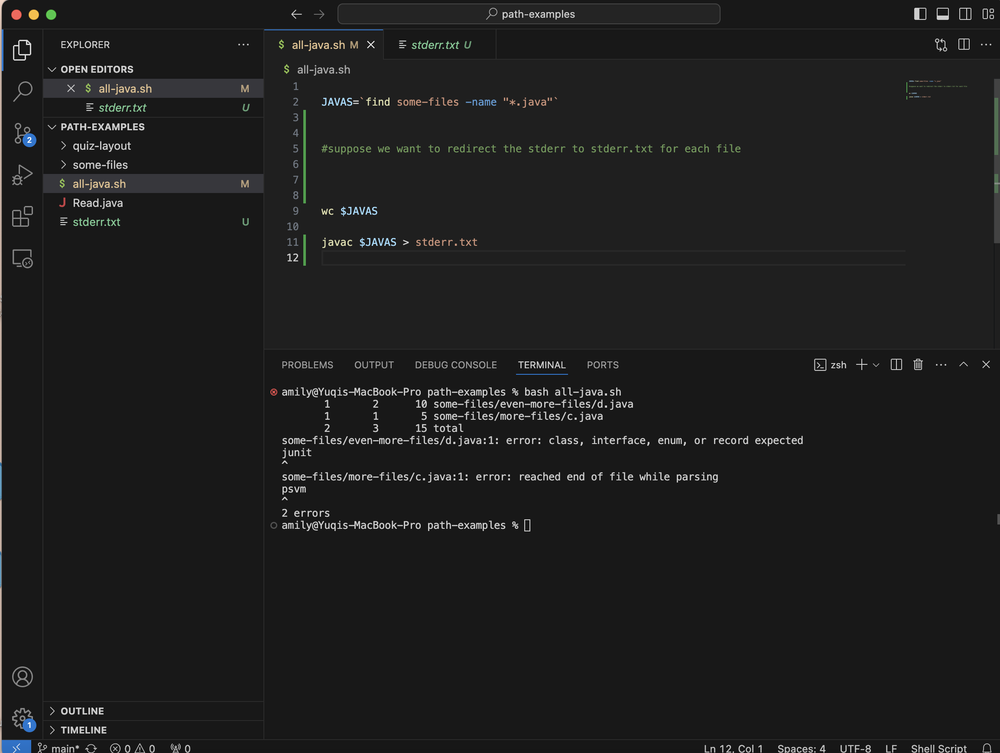
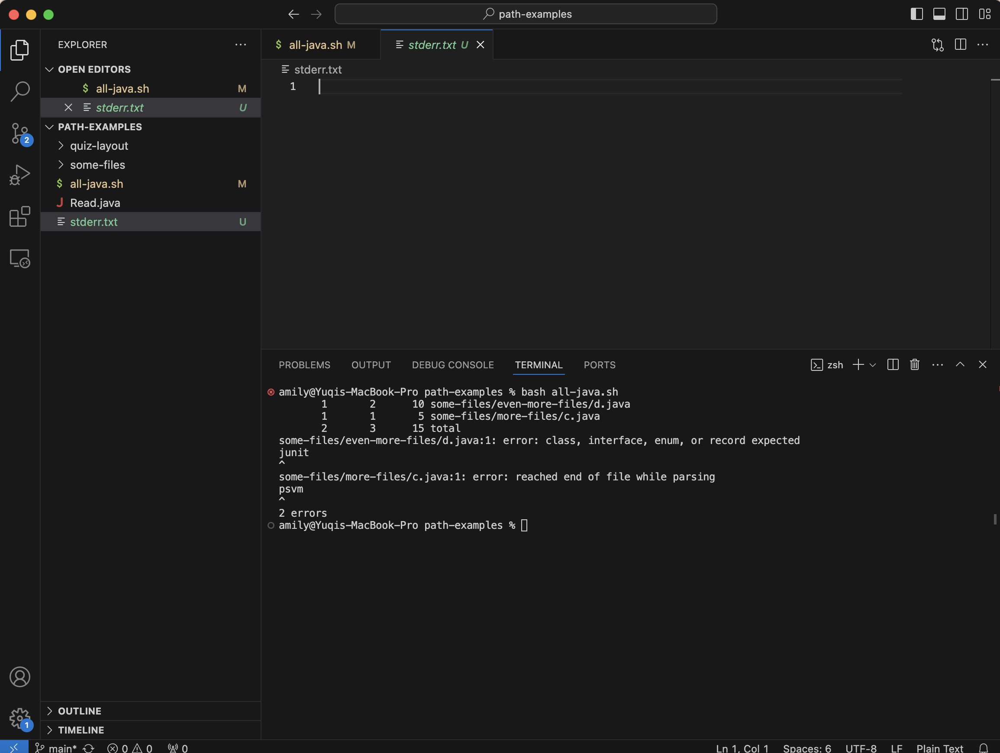
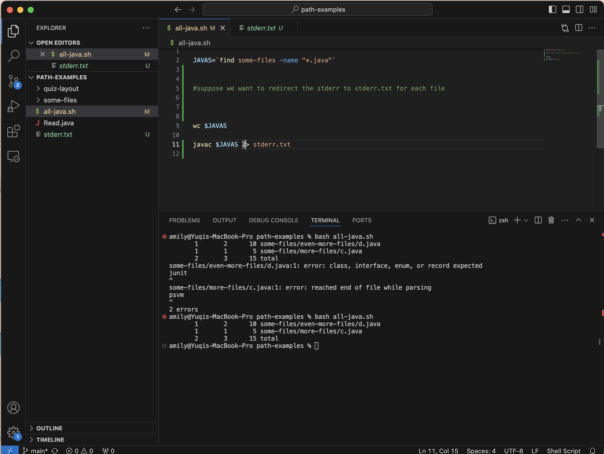
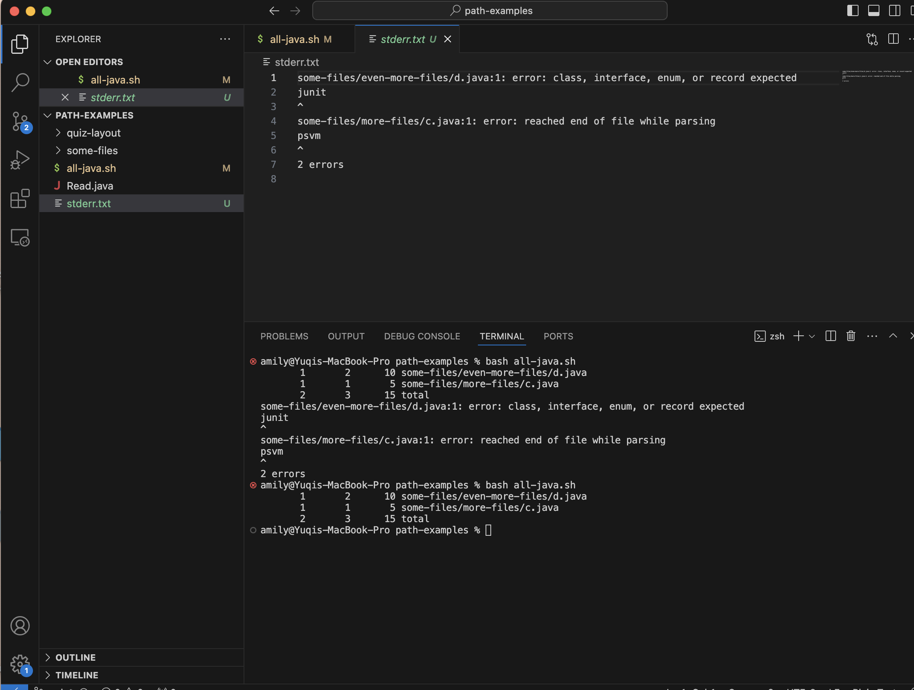
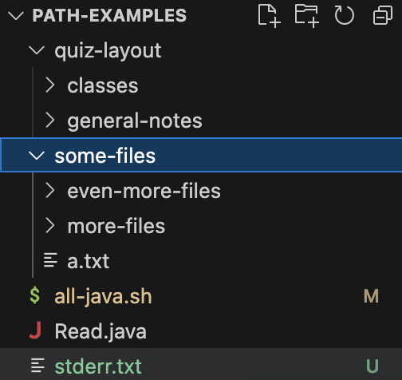
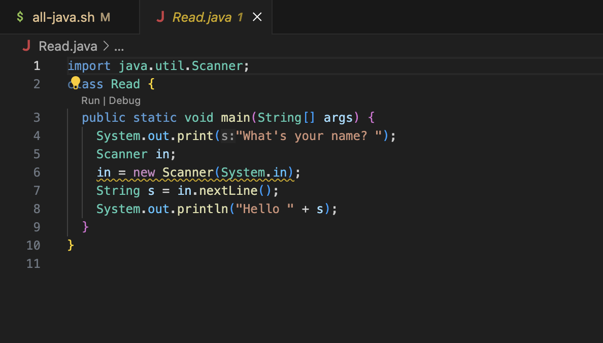
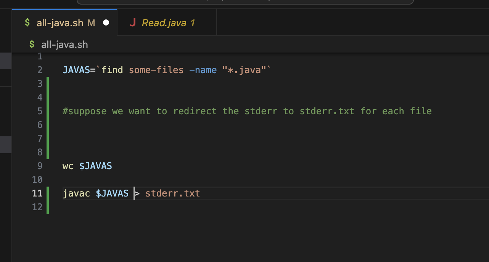
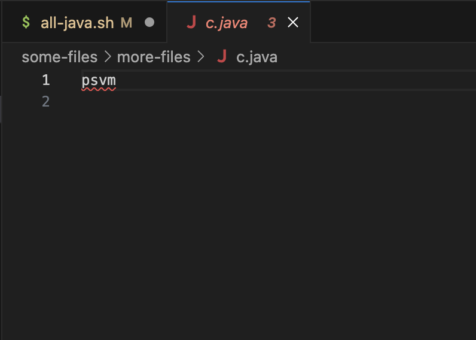
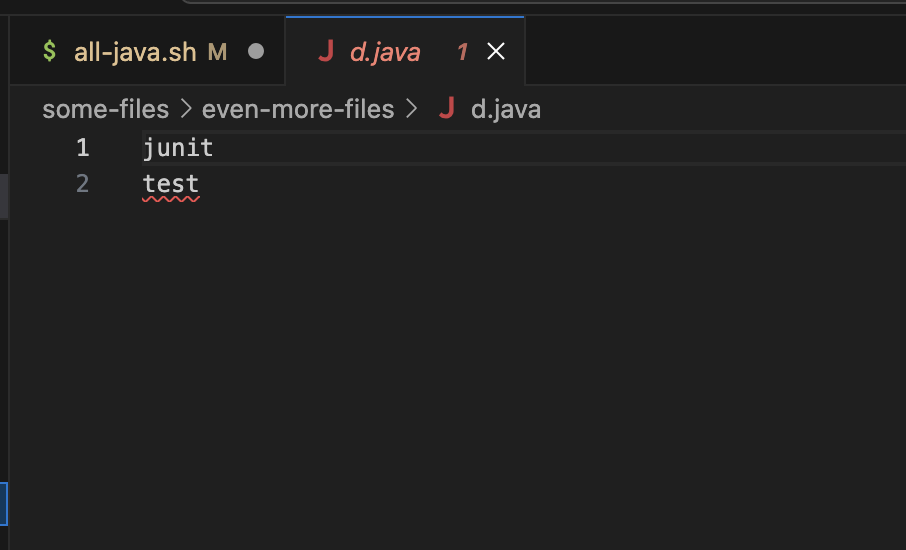
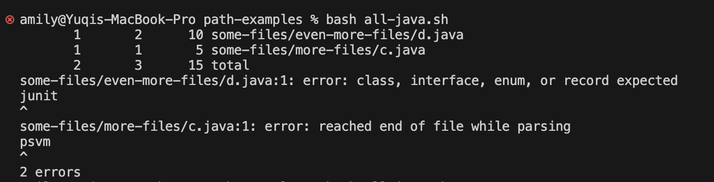

# Part 1 Debugging Scenario

## 1. original post

Suppose the student is asking to redirect the stderr output into a file called `stderr.txt`.
There are 2 error messages within `path-examples` folder. Thus, `stderr.txt` should contain these
error message. However, the `stderr.txt` is empty after the student use `bash all-java.sh`. 
Thus, the guess for failure-inducing input is that the student might using the wrong command for
redircting the type of output. 

Here is the bash script and `stderr.txt` after running `bash all-java.sh`

## 2. response from TA

The command for redirecting the stderr output to a certain file is `cmd 2> file.txt`. Thus, you should try add `2` before
the greater sign to redirect the correct type of output you want. You can change the last line of the bash script into
`javac $JAVAS 2> stderr.txt`

## 3. fixing the issue

The bug in `all-java.sh` is a logic error. Because the student is using the wrong command that lead to incorrect result. 
After we changed that into the correct command, the expected output shows up in `stderr.txt`

## 4. all info needed for setup

**The file & directory structure needed**

**The contents of each file before fixing the bug**

**The full command line (or lines) you ran to trigger the bug**

**A description of what to edit to fix the bug**
change `javac $JAVAS > stderr.txt` into `javac $JAVAS 2> stderr.txt`

# Part 2 Reflection

One thing that I learned from the lab during the second half of the quarter is how to use vim,
a powerful that help us to view and edit the file from the command line. And I got a chance to
practice using vim during skill demo4. This skill would be really helpful for my futrue CSE
learning. Also, my TA gave me a lot of help during the lab time when I encounter issues and helped
me to better understand the materials. So, I have a great time during the lab this quarter. Thanks :)

