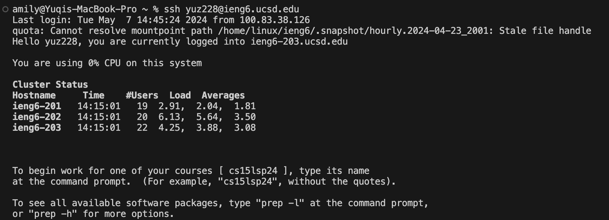
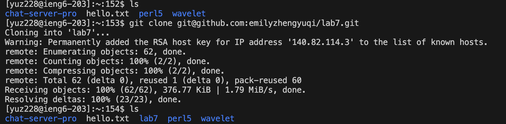
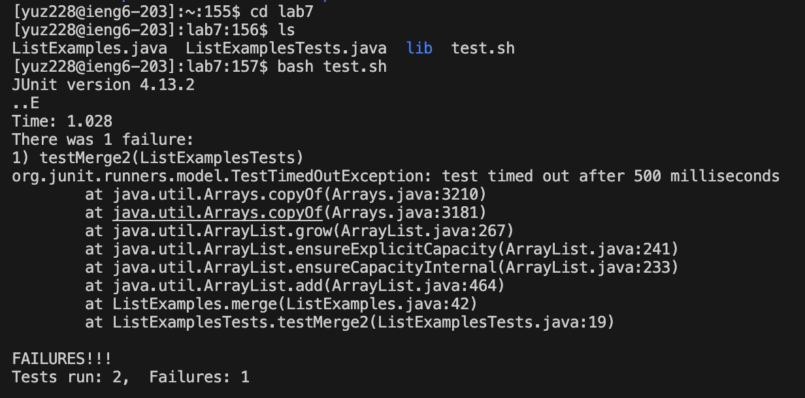
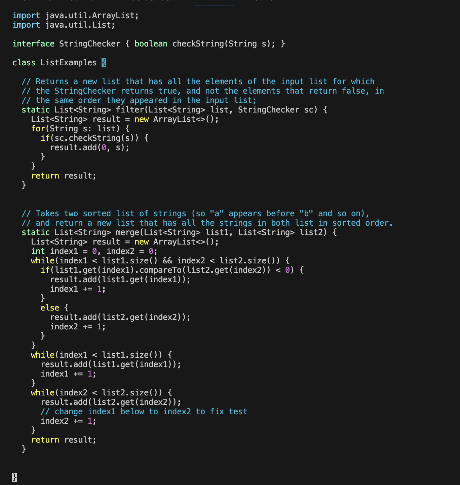
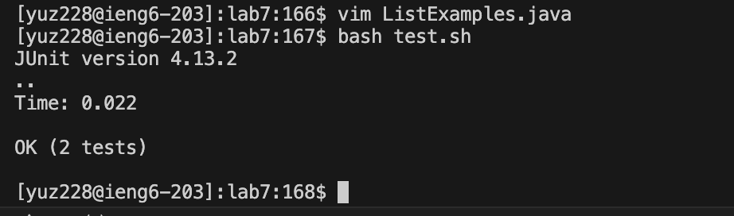
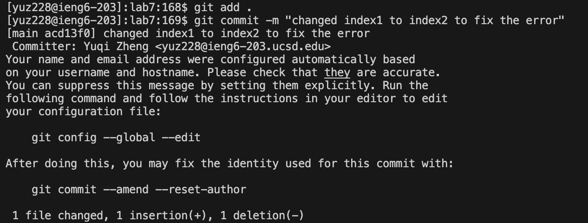
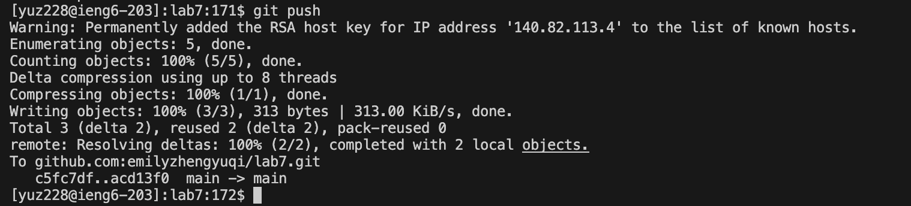

## Step 4:log into ieng6

input `ssh yuz228@ieng6.ucsd.edu` into the terminal and then hit `<return>` (on a mac system) tab to connect to remote equipment

## Step 5: clone forked repo through SSH URL

use `git clone git@github.com:emilyzhengyuqi/lab7.git`, the SSH URL, to clone the forked repo into ieng6 device. Then hit `<return>`

## Step 6: run the test, show the failures

First change the working directory to lab7 though `cd<space>lab7`
run the test through `bash<space>test.sh` and `<return>` to demonstrate the error message

## Step 7: edit the code to fix the error

First access the file through input `vim<space>ListExamples.java` & `<return>`
Then nevigate to code position that need to be fixed through hjkl
To change `index1` into `index2`, 
we first place the cursor to `1`, the text to delete, then  press `x` to delete this character
Then we shift to insert mode through press `i` and type `2` to fix the error.
Then press `esc` to shift from insert mode to normal mode
To save the changes we made, enter `:wq` and then press `<return>`

## Step 8: rerun the test, they should all passed

run the test through `bash<space>test.sh` and `<return>`

As the error is fixed, the tests should all passed

## Step 9: commit and push the changes into Github

use `git add .` to add all changes in the current working directory to staging area in Github

use `git commit -m "changed index1 to index2 to fix the error"` to save the changes with a commit message

use `git push` to push committed changes

